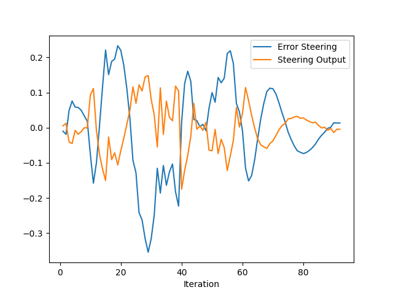
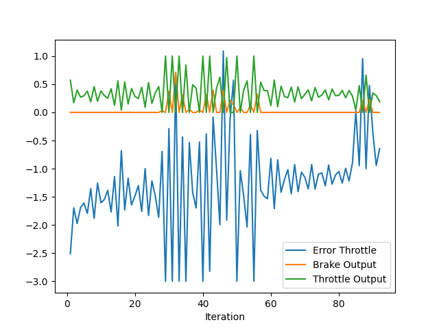

# Control and Trajectory Tracking for Autonomous Vehicle

# Proportional-Integral-Derivative (PID)

In this project, you will apply the skills you have acquired in this course to design a PID controller to perform vehicle trajectory tracking. Given a trajectory as an array of locations, and a simulation environment, you will design and code a PID controller and test its efficiency on the CARLA simulator used in the industry.

### Installation

Run the following commands to install the starter code in the Udacity Workspace:

Clone the <a href="https://github.com/udacity/nd013-c6-control-starter/tree/master" target="_blank">repository</a>:

`git clone https://github.com/udacity/nd013-c6-control-starter.git`

## Run Carla Simulator

Open new window

* `su - student`
// Will say permission denied, ignore and continue
* `cd /opt/carla-simulator/`
* `SDL_VIDEODRIVER=offscreen ./CarlaUE4.sh -opengl`

## Compile and Run the Controller

Open new window

* `cd nd013-c6-control-starter/project`
* `./install-ubuntu.sh`
* `cd pid_controller/`
* `rm -rf rpclib`
* `git clone https://github.com/rpclib/rpclib.git`
* `cmake .`
* `make` (This last command compiles your c++ code, run it after every change in your code)

## Testing

To test your installation run the following commands.

* `cd nd013-c6-control-starter/project`
* `./run_main_pid.sh`
This will silently fail `ctrl + C` to stop
* `./run_main_pid.sh` (again)
Go to desktop mode to see CARLA

If error bind is already in use, or address already being used

* `ps -aux | grep carla`
* `kill id`


## Project Instructions

In the previous project you built a path planner for the autonomous vehicle. Now you will build the steer and throttle controller so that the car follows the trajectory.

You will design and run the a PID controller as described in the previous course.

In the directory [/pid_controller](https://github.com/udacity/nd013-c6-control-starter/tree/master/project/pid_controller)  you will find the files [pid_controller.cpp](https://github.com/udacity/nd013-c6-control-starter/blob/master/project/pid_controller/pid_controller.cpp)  and [pid_controller.h](https://github.com/udacity/nd013-c6-control-starter/blob/master/project/pid_controller/pid_controller.h). This is where you will code your pid controller.
The function pid is called in [main.cpp](https://github.com/udacity/nd013-c6-control-starter/blob/master/project/pid_controller/main.cpp).

### Step 1: Build the PID controller object
Complete the TODO in the [pid_controller.h](https://github.com/udacity/nd013-c6-control-starter/blob/master/project/pid_controller/pid_controller.h) and [pid_controller.cpp](https://github.com/udacity/nd013-c6-control-starter/blob/master/project/pid_controller/pid_controller.cpp).

Run the simulator and see in the desktop mode the car in the CARLA simulator. Take a screenshot and add it to your report. The car should not move in the simulation.
### Step 2: PID controller for throttle:
1) In [main.cpp](https://github.com/udacity/nd013-c6-control-starter/blob/master/project/pid_controller/main.cpp), complete the TODO (step 2) to compute the error for the throttle pid. The error is the speed difference between the actual speed and the desired speed.

Useful variables:
- The last point of **v_points** vector contains the velocity computed by the path planner.
- **velocity** contains the actual velocity.
- The output of the controller should be inside [-1, 1].

2) Comment your code to explain why did you computed the error this way.

3) Tune the parameters of the pid until you get satisfying results (a perfect trajectory is not expected).

### Step 3: PID controller for steer:
1) In [main.cpp](https://github.com/udacity/nd013-c6-control-starter/blob/master/project/pid_controller/main.cpp), complete the TODO (step 3) to compute the error for the steer pid. The error is the angle difference between the actual steer and the desired steer to reach the planned position.

Useful variables:
- The variable **y_points** and **x_point** gives the desired trajectory planned by the path_planner.
- **yaw** gives the actual rotational angle of the car.
- The output of the controller should be inside [-1.2, 1.2].
- If needed, the position of the car is stored in the variables **x_position**, **y_position** and **z_position**

2) Comment your code to explain why did you computed the error this way.

3) Tune the parameters of the pid until you get satisfying results (a perfect trajectory is not expected).

### Step 4: Evaluate the PID efficiency
The values of the error and the pid command are saved in thottle_data.txt and steer_data.txt.
Plot the saved values using the command (in nd013-c6-control-refresh/project):

```
python3 plot_pid.py
```

You might need to install a few additional python modules: 

```
pip3 install pandas
pip3 install matplotlib
```

Answer the following questions:

### - Add the plots to your report and explain them (describe what you see)

The following plot shows the performance of the PID for steering.



We can see how the PID is trying to compensate the error by emulating it but with opposite sign. In this way, it tries to take it to 0. We can observe also that the steering output is generally lower than the error. This should be corrected by increasing the PID gains. However, increasing the coefficients can bring instability in the control of the car. 

The following plot shows the performance of the PID for the throttle.



Here, we can state that the velocity input is fragmented. This brings instability in the use of the PID that it's not able to copy the error. This is why the derivative gain is lower in this PID than the one for steering. An higher frequency should help with this problem. Also, we can observe the presence of a sistematic bias, that it's slowly corrected by the integrative gain of the PID. 

### - What is the effect of the PID according to the plots, how each part of the PID affects the control command?
The PID controls the steering and the throttle by imposing a command as close as possible to the absolute value of the error, but with the opposite sign. The P part of the PID give a command proportional to the magnitude of the error, the D adds a command based on how quickly the error is changing, whereas the I compensate for sistematic biases (like the one in the throttle PID shown above).

### - How would you design a way to automatically tune the PID parameters?
To automatically tune the PID parameters, we can apply the Twiddle method. We should write a script that runs sistematically the simulation and collects the results. The script will modify one gain per iteration. Due to the presence of 6 values to tweak, the number of possible results is pretty high. Therefore, we have to assign a good starting point. We can help the script by considering various parameters. For example, if we apply only a P gain and the mean of the error is close to 0, it could mean that there is no sistematic bias, and so the I gain can be set to 0 now on.

### - PID controller is a model free controller, i.e. it does not use a model of the car. Could you explain the pros and cons of this type of controller?
Avoiding the use of a model is helpful since:
- it can be applied easily to any kind of dynamic system;
- avoid the creation of an accurate model of the car that can be hard and time-consuming.
On the other hand, a model free controller:
- requires some time for tuning the parameters to address a specific application (like steering or throttle)
- it will hardly converge to 0 error for a dynamic control.
 
### - (Optional) What would you do to improve the PID controller?
The PID controller can be improved by increasing its control frequency or by filtering the data from the sensors. The second will prevent that outliers in the measurement phase cause an improvvise peak in the response.


### Tips:

- When you wil be testing your c++ code, restart the Carla simulator to remove the former car from the simulation.
- If the simulation freezes on the desktop mode but is still running on the terminal, close the desktop and restart it.
- When you will be tuning the PID parameters, try between those values:

